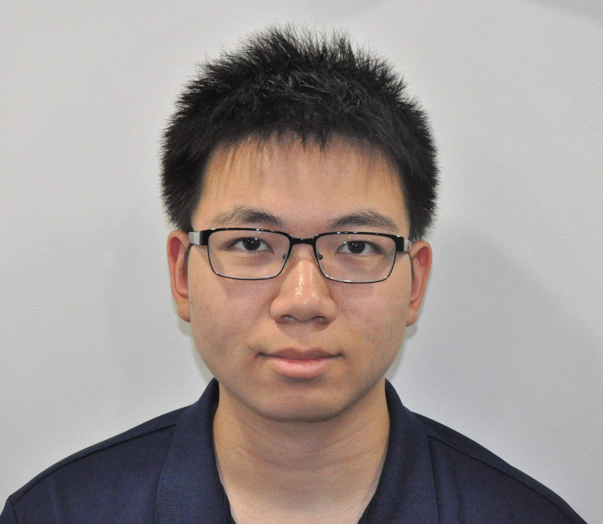

## Welcome to Dylan's Website 
Hi! My name's Dylan and I am currently a freshman at Cornell University, Class of 2025. I am from Queens, NY and I love eating and traveling. I went to Bronx Science from 2017-2021. Read below to find more about me! If you have any questions, shoot me an email or connect with me. 

What do I enjoy doing? As of 2021, I want to study computational biology and computer science. One skill I hope to learn is some data visualization. Right now, I only know how to make basic graphs but would like to have a formal introduction to better communicate my data analysis. So, I might have some data science, machine learning, and other scripts sprinkled into this website. I do want to try a bit of software development so this will just be a collection of everything! 

Here's a picture of me!

Below is what I would like to call my "portfolio". It is all the projects I have put siginficant time into. They may be good and they may be bad. When I look back at it in the future I hope that I can see where I came from. More importantly, while these projects may not be the best, I hope to showcase the little bits I learned from each project and give a reflection of what I learned and what I can improve on. My goal in the future is to be able to see if I improved from my personal reflections.

## [Personal Website v2.0 - In Progress]()
My goal is to convert this portfolio on Github Pages to a functioning website using React. 

## A7
Due to Cornell's Academic Integrity policy, I am not allowed to disclose the source code but would like to document my process and show a few screenshots. 

## [Used Cars Explorative Data and Predictive Analysis - FA21](https://github.com/DylanTom/info-final-project)

**The High School Years**

## [Personal Website v1.0 - SU21](https://github.com/DylanTom/Dylan-Website)
Summary: 

Duration: 2 weeks

## [Interpretation of Loss of Function Genes - FA20](https://github.com/DylanTom/InterpretationLoF)
Summary: 

Duration: 12 weeks

Description:
1. Analyzed a class of human genetic variants that created a nonsense mutation at the start of the protein
2. Attempted to determine if there was misclassification in the interpretation of pathogenicity in patients
3. Learned to filter and clean large datasets 
4. Applied bioinformatic analyses to develop visualizations
5. Drafted a technical document including literature review and interpretation of results

Results:

Reflection: There is a lot to reflect about for this project. Importance of code management

## [Hearthstone AI - SU20]()
Summary: Implemented a greedy heuristic algorithm to play the card game Hearthstone developed by Blizzard. 

Duration: 8 weeks

Description:
1. Utilized an open source framework 
2. Understood hundreds of lines of codes and learned how C# classes and functions can be implemented
3. Resolved logical errors in implementation of strategies through debugging and white box testing
4. Understood how to convert game rules and strategies into code

Reflection: 

[Forked Github Repo for Hearthstone AI](https://github.com/DylanTom/HearthstoneAICompetition)

### Contact Me
Want to contact me? Email me at **dt425@cornell.edu** or on [LinkedIn](https://linkedin.com/in/dylan-tom).