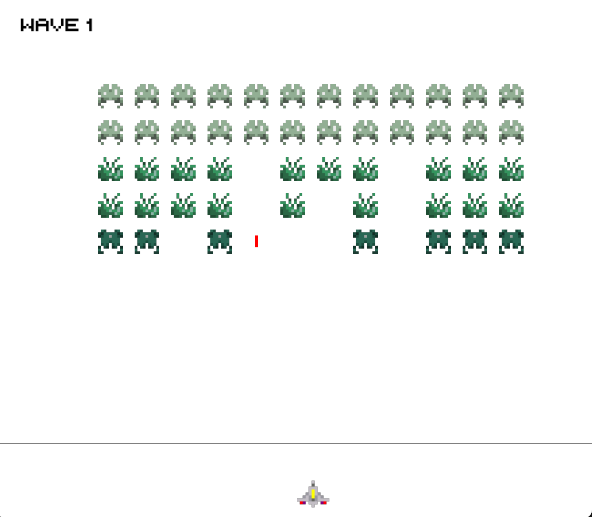
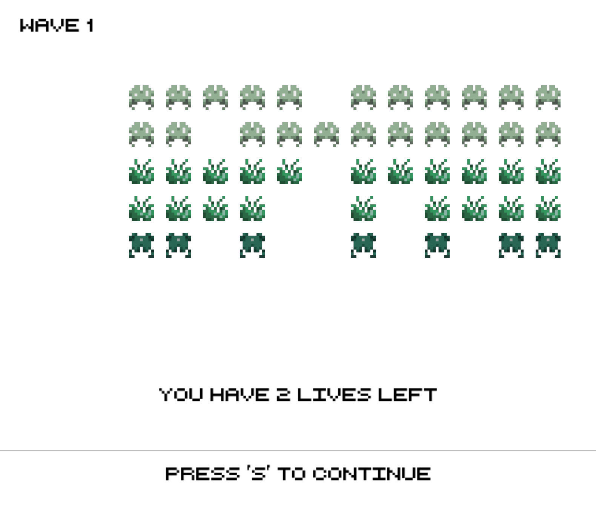
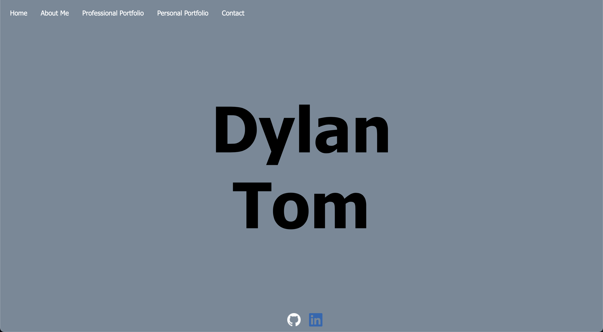
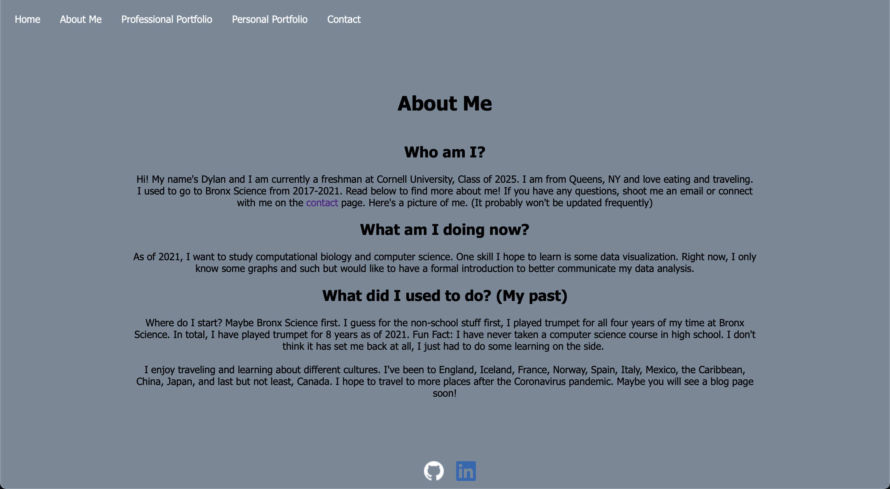
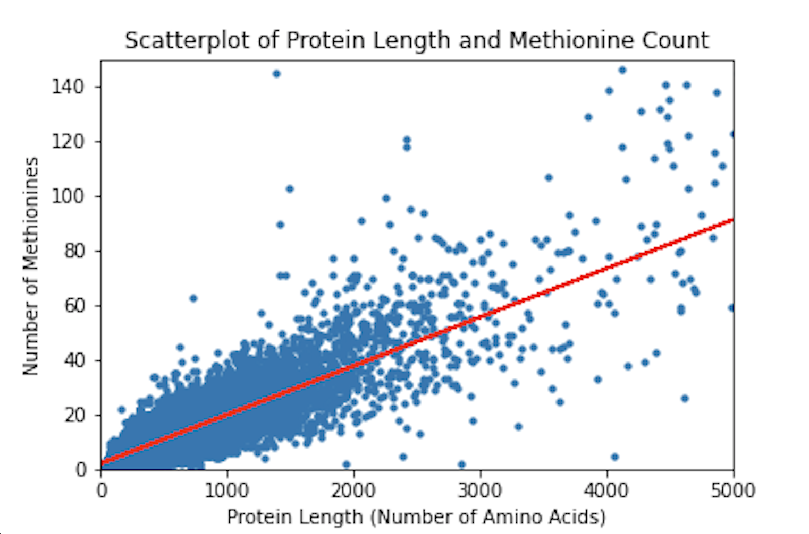
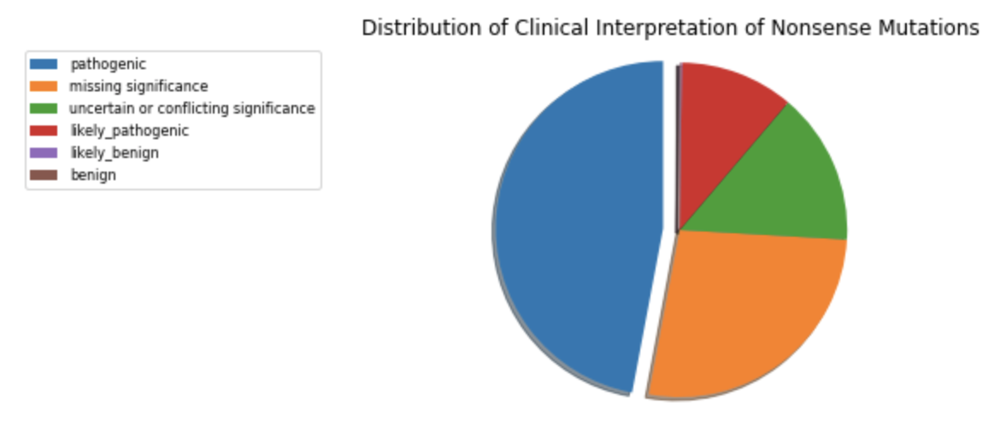
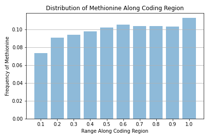

## Welcome to Dylan's Website 
Hi! My name's Dylan and I am currently a freshman at Cornell University, Class of 2025. I am from Queens, NY and I love food and traveling. I went to Bronx Science from 2017-2021. Read below to find more about me! If you have any questions, shoot me an email or connect with me. 

What do I enjoy doing? As of 2021, I want to study computational biology and computer science. One skill I hope to learn is some data visualization. Right now, I only know how to make basic graphs but would like to have a formal introduction to better communicate my data analysis. So, I might have some data science, machine learning, and other scripts sprinkled into this website. I do want to try a bit of software development so this will just be a collection of everything! 

Here's a picture of me!

Below is what I would like to call my "portfolio". It is all the projects I have put siginficant time into. They may be good and they may be bad. When I look back at it in the future I hope that I can see where I came from. More importantly, while these projects may not be the best, I hope to showcase the little bits I learned from each project and give a reflection of what I learned and what I can improve on. My goal in the future is to be able to see if I improved from my personal reflections.

## [Personal Website v2.0 - In Progress]()
My goal is to convert this portfolio on Github Pages to a functioning website using React. 

Tags: React, web development

## [Alien Invaders - FA21]()
Due to Cornell's Academic Integrity policy, I am not allowed to disclose the source code but would like to document my process, show a few screenshots, and reflect on this project.

Summary: Created an "Alien Invaders" game in Python for an introductory computer science course. 

Duration: 3 weeks

Description:
1. Read class documentation and APIs
2. Designed helper functions to properly structure code
3. Using constants to improve readability of code
4. Programming animation and simple collisions
5. Open-ended project that is not fully specified

Reflection:

Tags: python, game development, object oriented programming, open-ended project

## [Used Cars Analysis - FA21](https://github.com/DylanTom/info-final-project)
Summary: Performed explorative and predictive data analysis on a open source, unprocessed dataset. 

Duration: 5 weeks

Description:
1. Performed data filtering and processing on a large, open dataset
2. Created visualizations that describe aspects of the dataset
3. Added a linear regression model and a K-nearest neighbors analysis

Reflection: This was the first project I worked in a small group of three for my information science class at Cornell University. We had to find an open source dataset which might not have been clean. There was a lot of noise we had to filter and we had to encode several categorical variables in order to perform numerical analysis. I gained experience using Github as a collaboration platform and used Jupyter notebook to document a "storytelling" of the dataset. Using knowledge from class lectures, we implemented different data visualizations and supervised machine learning algorithms. 

Tags: data science, Python, Jupyter Notebook, machine learning

**The High School Years**

## [Personal Website v1.0 - SU21](https://github.com/DylanTom/Dylan-Website)
Summary: Developed a personal website with a home, contact, and an about me page using HTML and CSS. 

Duration: 2 weeks

Description:
1. Learned HTML and CSS to make a barebone website
2. Developed an understanding for stylistic choices and features

On the left pane you can see the homepage to my website. On the right pane you can see the about me page. 

Reflection: This was a very quick two week project I had over the summer of 2021. There were not many challenges with this but it was challenging for me to understand CSS flexboxes. I'm not a very good designer so I don't know what colors match and what features should go in certain positions. For example, the gray background does not seem to complement the black text. 

Tags: HTML, CSS, web development

## [Interpretation of Loss of Function Genes - FA20](https://github.com/DylanTom/InterpretationLoF)
Summary: Computationally analyzed genetic data to draw conclusions on loss of function genes. 

Duration: 12 weeks

Description:
1. Analyzed a class of human genetic variants that created a nonsense mutation at the start of the protein
2. Attempted to determine if there was misclassification in the interpretation of pathogenicity in patients
3. Learned to filter and clean large datasets 
4. Applied bioinformatic analyses to develop visualizations
5. Drafted a technical document including literature review and interpretation of results

Select Figures: On the upper left pane is a scatter plot with a least squares regression line between the number of methionine amino acids in the protein and the protein length. On the upper right pane is a pie chart with the distribution of the interpretations of the clinical significances. On the bottom pane is the distribution of the methionine amino acids along the coding region.  

Reflection: There are a lot of lessons learned when I completed this research project. The most important one that still sticks with me is to properly store files and have a good organization system. If you happen to take a peek at the repository there doesn't appear to be any order or system to keep the files. From this project I learned to label files with data, scripts, or figures and to have a file management system in place before making files. In addition, I created simple data visualizations using matplotlib.pyplot and created scatter plots, bar charts, and pie charts. Creating multiple functions was hard and I ended up creating a bunch of redundant files which cluttered the project even more. When there is a function I might use but it is a draft, I should keep a document but only have one version up and running at a time. This was a hard research problem in which I felt I did not conclude as much as I wanted to but it was a very good experience. 

Tags: bioinformatics, Jupyter Notebook, data science, Python

## [Hearthstone AI - SU20](https://github.com/DylanTom/Hearthstone-AI)
Summary: Implemented a greedy heuristic algorithm to play the card game Hearthstone developed by Blizzard. 

Duration: 8 weeks

Description:
1. Utilized an open source framework 
2. Understood hundreds of lines of codes and learned how C# classes and functions can be implemented
3. Resolved logical errors in implementation of strategies through debugging and white box testing
4. Understood how to convert game rules and strategies into code

Reflection: This was my first time seeing and using open source files. It was very difficult to understand the file structure. There's no official documentation similar to built in functions so I spent a lot of time reading through the files and understanding the mechnics in an entirely new syntax. There was only one file that I had to modify and that was the AI agent file. This was the first of many hiccups I encountered in this project. Another was implementing the functions. This was before I had any formal training in computer science so I didn't understand what classes and inheritance actually were, which made this project a lot harder. I also didn't know anything about efficient algorithms so as I look back at my code there were a lot of nested for loops and useless if statements. Now, I realize how important specifications are because they make sure the user and the definer understand what the function does and what the appropriate parameters are. 

Tags: open source, C#, debugging, greedy algorithm

[Forked Github Repo for Hearthstone AI](https://github.com/DylanTom/HearthstoneAICompetition)

### Contact Me
Want to contact me? Email me at **dt425@cornell.edu** or on [LinkedIn](https://linkedin.com/in/dylan-tom). 