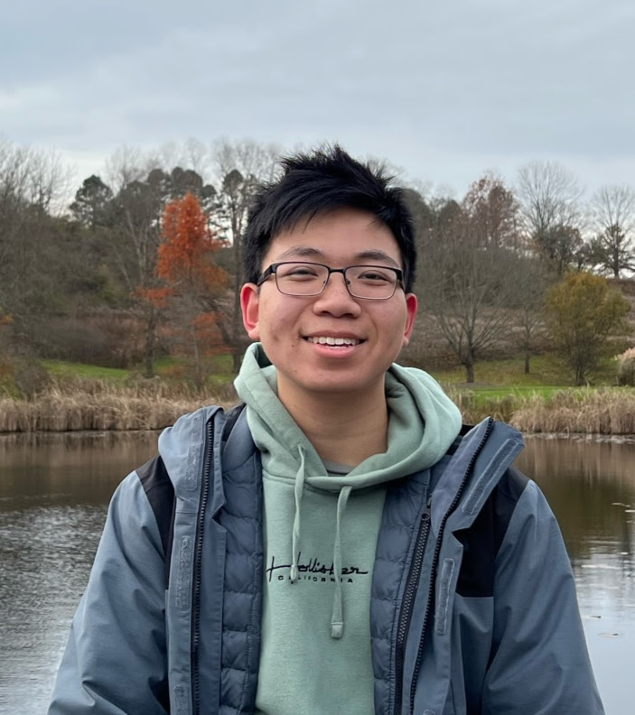

## Welcome to Dylan's Website 
Hi! My name's Dylan and I am currently a freshman at Cornell University, Class of 2025. I am from Queens, NY and I love eating and traveling. I went to Bronx Science from 2017-2021. Read below to find more about me! If you have any questions, shoot me an email or connect with me. 

What do I enjoy doing? As of 2021, I want to study computational biology and computer science. One skill I hope to learn is some data visualization. Right now, I only know some graphs and such but would like to have a formal introduction to better communicate my data analysis. So, I might have some data science, machine learning, and other scripts sprinkled into this website. 

## [Used Cars Explorative Data and Predictive Analysis](https://github.com/DylanTom/info-final-project)

## Project 2 - 

## Project 3 - 

## Project 4 - 

## Project 5 - 

### Contact Me
Want to contact me? Email me at **dt425@cornell.edu** or on [LinkedIn](https://linkedin.com/in/dylan-tom)